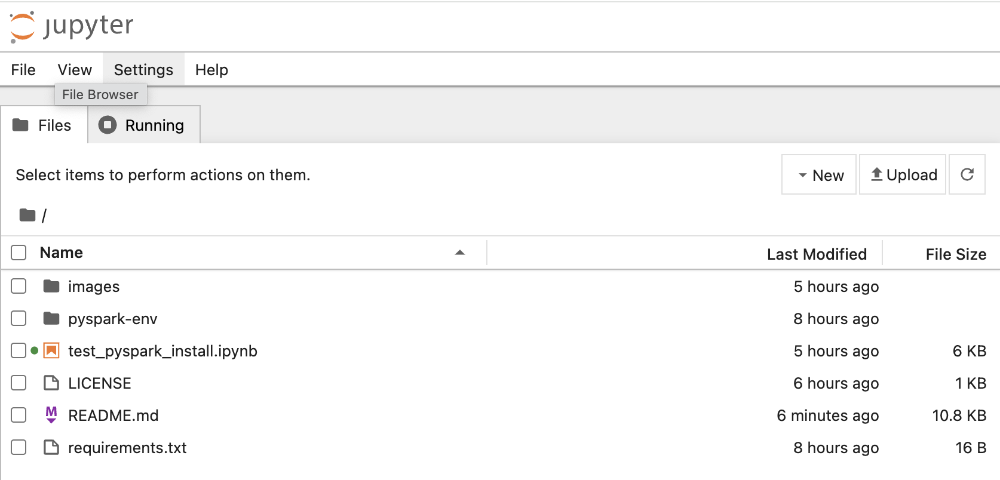
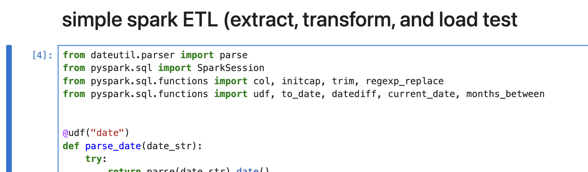
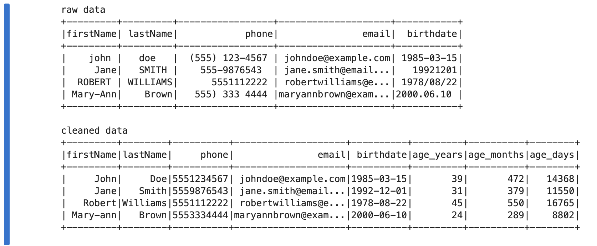
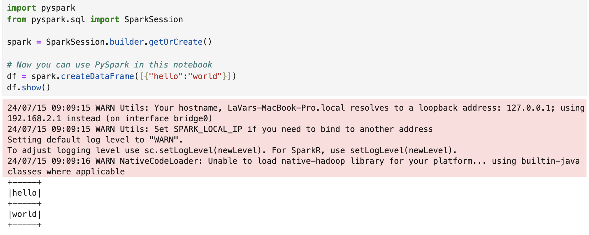

# PySpark Installation on macOS

This guide provides step-by-step instructions for installing PySpark, Hadoop, and Jupyter on macOS.

## About

This guide aims to simplify the PySpark installation process on macOS by addressing common challenges and promoting best practices.

**Key Features:**

- **Simplicity:** Clear and concise instructions with minimal configuration.
- **Reliability:** Thoroughly tested steps to ensure consistent success.
- **Best Practices:** Emphasis on using Python virtual environments for isolation and maintainability.
- **Troubleshooting:**  Documentation of common errors and their solutions.

By following this guide, you'll establish a solid foundation for your data science or data engineering projects with PySpark.

## Tested With

#### Applications

[![Brew][Brew-logo]][Brew-url]
[![Java][Java-logo]][Java-url]
[![Python][Python-logo]][Python-url]
[![Spark][Spark-logo]][Spark-url]

#### Python Packages
[![Jupyter][PyPI-jupyter-logo]][PyPI-jupyter-url]
[![PySpark][PyPI-PySpark-logo]][PyPI-pyspark-url]   
NOTE: pip install jupyter also installs jupyterlab and notebook.  

## Prerequisites

#### 1. Install Homebrew: If you don't have Homebrew, install it from the terminal:   
		/bin/bash -c "$(curl -fsSL [https://raw.githubusercontent.com/Homebrew/install/HEAD/install.sh](https://raw.githubusercontent.com/Homebrew/install/HEAD/install.sh))"

#### 2. Check/Install Python: If you already have Python installed, check the version:   
		python --version

#### 2a. If you don't have Python, or if the version is older than 3.12, install Python 3.12 using Brew:   
		brew install python@3.12

## Installation

#### 1. Install Spark and Hadoop:
		brew install apache-spark hadoop

#### 2. Create a Python Virtual Environment:   
		cd <your_project_directory>
		python -m venv pyspark-env
		source pyspark-env/bin/activate

#### 3. Create requirements.txt: in your project directory with the following content:   
		jupyter
		pyspark

#### 4. Install the packages:
		pip install -r requirements.txt

#### 5. Update Environment Variables: Add the following to your ~/.zshrc file (or the appropriate shell configuration file):   
		##
		## pyspark with hadoop
		##
		export JAVA_HOME=$(/usr/libexec/java_home)
		export PYSPARK_PYTHON=/usr/local/bin/python3 # Or your Python path
		# Replace the spark <version> example
		# export SPARK_HOME=/opt/homebrew/Cellar/apache-		spark/<version>/libexec 
		export SPARK_HOME=/opt/homebrew/Cellar/apache-spark/3.5.1/libexec 
		# Replace the hadoop <version> example
		# export HADOOP_HOME=/opt/homebrew/Cellar/hadoop/<version>/libexec
		export HADOOP_HOME=/opt/homebrew/Cellar/hadoop/3.4.0/libexec
		# update the path(s)
		export PATH=$SPARK_HOME/bin:$HADOOP_HOME/bin$PATH
		# jupyterlab
		export PYSPARK_DRIVER_PYTHON="jupyter"
		export PYSPARK_DRIVER_PYTHON_OPTS="notebook" 
		##
		## pyspark with hadoop end
		##

#### 6. Restart Terminal and Reactivate Environment: 
		cd <your_project_directory>
		source pyspark-env/bin/activate

NOTES: Python virtual environments (venv) offer several key benefits:  

<table>
<tr><td>
<b>Isolation of Project Dependencies</b>:
</td><td>
Each project gets its own isolated environment with specific package versions. This prevents conflicts between different projects that might require different versions of the same library.    
</td></tr>
<tr><td>
<b>Clean System Installation</b>:
</td><td>
You can experiment with new libraries or different versions without cluttering your global Python installation.    
</td></tr>
<tr><td>
<b>Reproducibility</b>:  
</td><td>
Easily recreate the same environment on different machines, ensuring consistency across development, testing, and production environments.   
</td></tr>
<tr><td>
<b>Version Control</b>:  
</td><td>
The requirements.txt file generated within a venv helps track and easily reinstall specific package versions.    
</td></tr>
<tr><td>
<b>Simplified Collaboration</b>:  
</td><td>
Team members can set up identical development environments, reducing compatibility issues.    
</td></tr>
<tr><td>
<b>In summary</b>:  
</td><td>
Python venv is a valuable tool for managing dependencies, keeping your projects organized, and ensuring smooth collaboration with others.  
</td></tr>
</td></tr>
</table>

Commands to start and stop the python venv 

<table>
<tr><td>
start
</td><td>
source pyspark-env/bin/activate
</td></tr>
</td></tr>
<tr><td>
stop
</td><td>
deactivate
</td></tr>
</table>

## Testing

#### 1. [download](https://github.com/LaVarEdwards/pyspark/blob/main/test_pyspark_install.ipynb) the jupyter notebook 
 
#### 2. start pyspark
		pyspark

#### 3. Open and run the test\_pyspark\_install.ipynb notebook to verify the installation.

#### test a simple ETL process

#### results of ETL process

## INSTALL NOTES

#### Warning messages avoided using these installation instructions

###### jupyter WARNings
		<date and timestamp> WARN Utils: Your hostname, <hostname>.local resolves to a loopback address: 127.0.0.1; using <different address> instead (on interface bridge0)
		<date and timestamp> WARN Utils: Set SPARK_LOCAL_IP if you need to bind to another address

These warnings are resolved by installing jupyter instead of jupyterlab in requirements.txt

###### hadoop WARNings
		<date and timestamp> WARN NativeCodeLoader: Unable to load native-hadoop library for your platform... using builtin-java classes where applicable

This warning is fixed by installing hadoop (brew install hadoop) and setting the environment variable HADOOP_HOME=/opt/homebrew/Cellar/hadoop/3.4.0/libexec

###### pyspark command
		export PYSPARK_DRIVER_PYTHON="jupyter"
		export PYSPARK_DRIVER_PYTHON_OPTS="notebook" 

Running jupyter from pyspark is accomplished using  PYSPARK\_DRIVER\_PYTHON and PYSPARK\_DRIVER\_PYTHON\_OPTS 

## Contributing

Contributions are what make the open source community such an amazing place to learn, inspire, and create. Any contributions you make are **greatly appreciated**.

If you have a suggestion that would make this better, please fork the repo and create a pull request. You can also simply open an issue with the tag "enhancement".
Don't forget to give the project a star! Thanks again!

1. Fork the Project
2. Create your Feature Branch (`git checkout -b feature/AmazingFeature`)
3. Commit your Changes (`git commit -m 'Add some AmazingFeature'`)
4. Push to the Branch (`git push origin feature/AmazingFeature`)
5. Open a Pull Request

## License

Distributed under the MIT License. See `LICENSE.txt` for more information.

## Contact

Project Link: [https://github.com/LaVarEdwards/pyspark](https://github.com/LaVarEdwards/pyspark)

<!-- ACKNOWLEDGMENTS -->

<!-- MARKDOWN LINKS & IMAGES -->
<!-- https://www.markdownguide.org/basic-syntax/#reference-style-links -->

<!--  social media -->
[linkedin-url]: https://linkedin.com/in/lavaredwards
[product-screenshot]: images/screenshot.png
[linkedin-shield]: https://img.shields.io/badge/-LinkedIn-black.svg?style=for-the-badge&logo=linkedin&colorB=555

<!--  applications -->
[Brew-logo]: https://img.shields.io/badge/brew-4.3.9-blue
[Brew-url]: https://www.java.com/en/download/help/java_mac.html

[Java-logo]: https://img.shields.io/badge/java-18.0.2-blue
[Java-url]: https://www.java.com/en/download/help/java_mac.html

[Python-logo]: https://img.shields.io/badge/python-3.12.4-blue
[Python-url]: https://www.python.org/downloads/

[Spark-logo]: https://img.shields.io/badge/spark-3.5.1-blue
[Spark-url]: https://spark.apache.org/downloads.html

<!--  python pip packages -->
[PyPI-PySpark-logo]: https://img.shields.io/badge/pyspark-3.5.1-blue
[PyPI-PySpark-url]: https://pypi.org/project/pyspark/

[PyPI-jupyter-logo]: https://img.shields.io/badge/jupyter-1.0.0-blue
[PyPI-jupyter-url]: https://pypi.org/project/jupyter/

