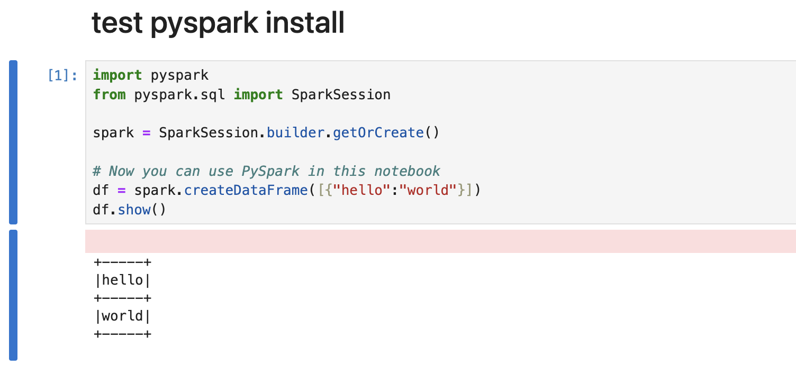

# pyspark
 Installation instructiuons for PySpark on macOS

<!-- PROJECT SHIELDS -->
<!--
*** I'm using markdown "reference style" links for readability.
*** Reference links are enclosed in brackets [ ] instead of parentheses ( ).
*** See the bottom of this document for the declaration of the reference variables
*** for contributors-url, forks-url, etc. This is an optional, concise syntax you may use.
*** https://www.markdownguide.org/basic-syntax/#reference-style-links
-->
[![Contributors][contributors-shield]][contributors-url]
[![Forks][forks-shield]][forks-url]
[![Stargazers][stars-shield]][stars-url]
[![Issues][issues-shield]][issues-url]
[![MIT License][license-shield]][license-url]
[![LinkedIn][linkedin-shield]][linkedin-url]

<!-- PROJECT LOGO -->
 

  

  <h3 align="center">Install PySpark on macOS</h3>

  

   Instructions to install PySpark, Hadoop, and Jupyter on macOS
     
    <a href="https://github.com/othneildrew/Best-README-Template"><strong>Explore the docs »</strong></a>
  

<!-- TABLE OF CONTENTS -->

  
Table of Contents

  <ol>
    <li>
      <a href="#about-the-project">About The Project</a>
      <ul>
        <li><a href="#built-with">Built With</a></li>
      </ul>
    </li>
    <li>
      <a href="#getting-started">Getting Started</a>
      <ul>
        <li><a href="#prerequisites">Prerequisites</a></li>
        <li><a href="#installation">Installation</a></li>
      </ul>
    </li>
    <li><a href="#usage">Usage</a></li>
    <li><a href="#roadmap">Roadmap</a></li>
    <li><a href="#contributing">Contributing</a></li>
    <li><a href="#license">License</a></li>
    <li><a href="#contact">Contact</a></li>
    <li><a href="#acknowledgments">Acknowledgments</a></li>
  </ol>

<!-- ABOUT THE PROJECT -->
## About The Project

<!--  -->

There are many examples of installing PySpark available; however, I didn't find one that really suited my needs.

My goal in creating these PySpark installation instructions is to address the common challenges I've encountered with existing resources. I aim to offer a streamlined, error-free guide that empowers users to quickly set up PySpark in a best-practice environment on their Mac.

Here's what sets this guide apart:

* Simplicity: I've focused on the minimum essential steps, avoiding unnecessary configurations that can lead to confusion.  
* Reliability: I've meticulously tested and refined the instructions to ensure they work consistently, reducing frustration for users.  
* Best Practices: The guide emphasizes the use of Python virtual environments to isolate project dependencies, promoting clean and maintainable code. This approach also helps avoid conflicts with other Python tools or libraries you may have installed on your system.  
* Troubleshooting: I've documented common installation errors and their solutions, saving you valuable time and effort.  

By following this guide, you'll be able to confidently install PySpark and begin your data science or data engineering projects on a solid foundation."

Here's why:  
* Your time should be focused on creating something amazing. A project that solves a problem and helps others. 
* You shouldn't be doing the same tasks over and over like creating a README from scratch
* You should implement DRY principles to the rest of your life :smile:  

(<a href="#readme-top">back to top</a>)

## Tested With

#### Applications

[![Brew][Brew-logo]][Brew-url]
[![Java][Java-logo]][Java-url]
[![Python][Python-logo]][Python-url]
[![Spark][Spark-logo]][Spark-url]

#### Python Packages

NOTE: pip install jupyter also installs jupyterlab and notebook.  
[![Jupyter][PyPI-jupyter-logo]][PyPI-jupyter-url]
[![PySpark][PyPI-PySpark-logo]][PyPI-pyspark-url]   

(<a href="#readme-top">back to top</a>)

<!-- GETTING STARTED -->
## Prerequisites

Install brew.   
Homebrew installs the stuff you need that Apple (or your Linux system) didn’t.

#### From the terminal window, enter:   
		/bin/bash -c "$(curl -fsSL https://raw.githubusercontent.com/Homebrew/install/HEAD/install.sh)"

#### confirm brew is installed and updated:   
		brew update
		brew upgrade
		
#### Is python installed?
		python --version

##### If python is not installed, use brew to install
		brew install python@3.12

(<a href="#readme-top">back to top</a>)

<!-- USAGE EXAMPLES -->
## Installation Instructions

#### Install spark and hadoop
		brew install apache-spark hadoop

#### Create a python venv (virtual environment)
		cd <change to the project root directory>
		mkdir <name of the project>
		python -m venv pyspark-env
		source pyspark-env/bin/activate

NOTES: Python virtual environments (venv) offer several key benefits:  

<table>
<tr><td>
<b>Isolation of Project Dependencies</b>:
</td><td>
Each project gets its own isolated environment with specific package versions. This prevents conflicts between different projects that might require different versions of the same library.    
</td></tr>
<tr><td>
<b>Clean System Installation</b>:
</td><td>
You can experiment with new libraries or different versions without cluttering your global Python installation.    
</td></tr>
<tr><td>
<b>Reproducibility</b>:  
</td><td>
Easily recreate the same environment on different machines, ensuring consistency across development, testing, and production environments.   
</td></tr>
<tr><td>
<b>Version Control</b>:  
</td><td>
The requirements.txt file generated within a venv helps track and easily reinstall specific package versions.    
</td></tr>
<tr><td>
<b>Simplified Collaboration</b>:  
</td><td>
Team members can set up identical development environments, reducing compatibility issues.    
</td></tr>
<tr><td>
<b>In summary</b>:  
</td><td>
Python venv is a valuable tool for managing dependencies, keeping your projects organized, and ensuring smooth collaboration with others.  
</td></tr>
</td></tr>
</table>

Commands to start and stop the python venv 

<table>
<tr><td>
<tr><td>
start
</td><td>
source pyspark-env/bin/activate
</td></tr>
</td></tr>
<tr><td>
stop
</td><td>
deactivate
</td></tr>
</table>

#### From the terminal window, enter:   
		/bin/bash -c "$(curl -fsSL https://raw.githubusercontent.com/Homebrew/install/HEAD/install.sh)"

Use this space to show useful examples of how a project can be used. Additional screenshots, code examples and demos work well in this space. You may also link to more resources.

_For more examples, please refer to the [Documentation](https://example.com)_

(<a href="#readme-top">back to top</a>)

<!-- CONTRIBUTING -->
## Contributing

Contributions are what make the open source community such an amazing place to learn, inspire, and create. Any contributions you make are **greatly appreciated**.

If you have a suggestion that would make this better, please fork the repo and create a pull request. You can also simply open an issue with the tag "enhancement".
Don't forget to give the project a star! Thanks again!

1. Fork the Project
2. Create your Feature Branch (`git checkout -b feature/AmazingFeature`)
3. Commit your Changes (`git commit -m 'Add some AmazingFeature'`)
4. Push to the Branch (`git push origin feature/AmazingFeature`)
5. Open a Pull Request

(<a href="#readme-top">back to top</a>)

<!-- LICENSE -->
## License

Distributed under the MIT License. See `LICENSE.txt` for more information.

(<a href="#readme-top">back to top</a>)

<!-- CONTACT -->
## Contact

Your Name - [@your_twitter](https://twitter.com/your_username) - email@example.com

Project Link: [https://github.com/LaVarEdwards/pyspark](https://github.com/LaVarEdwards/pyspark)

(<a href="#readme-top">back to top</a>)

<!-- ACKNOWLEDGMENTS -->

<!-- MARKDOWN LINKS & IMAGES -->
<!-- https://www.markdownguide.org/basic-syntax/#reference-style-links -->

<!--  social media -->
[linkedin-url]: https://linkedin.com/in/lavaredwards
[product-screenshot]: images/screenshot.png
[linkedin-shield]: https://img.shields.io/badge/-LinkedIn-black.svg?style=for-the-badge&logo=linkedin&colorB=555

<!--  applications -->
[Brew-logo]: https://img.shields.io/badge/brew-4.3.9-blue
[Brew-url]: https://www.java.com/en/download/help/java_mac.html

[Java-logo]: https://img.shields.io/badge/java-18.0.2-blue
[Java-url]: https://www.java.com/en/download/help/java_mac.html

[Python-logo]: https://img.shields.io/badge/python-3.12.4-blue
[Python-url]: https://www.python.org/downloads/

[Spark-logo]: https://img.shields.io/badge/spark-3.5.1-blue
[Spark-url]: https://spark.apache.org/downloads.html

<!--  python pip packages -->
[PyPI-PySpark-logo]: https://img.shields.io/badge/pyspark-3.5.1-blue
[PyPI-PySpark-url]: https://pypi.org/project/pyspark/

[PyPI-jupyter-logo]: https://img.shields.io/badge/jupyter-1.0.0-blue
[PyPI-jupyter-url]: https://pypi.org/project/jupyter/

[contributors-shield]: https://img.shields.io/github/contributors/othneildrew/Best-README-Template.svg?style=for-the-badge
[contributors-url]: https://github.com/othneildrew/Best-README-Template/graphs/contributors
[forks-shield]: https://img.shields.io/github/forks/othneildrew/Best-README-Template.svg?style=for-the-badge
[forks-url]: v
[stars-shield]: https://img.shields.io/github/stars/othneildrew/Best-README-Template.svg?style=for-the-badge
[stars-url]: https://github.com/othneildrew/Best-README-Template/stargazers
[issues-shield]: https://img.shields.io/github/issues/othneildrew/Best-README-Template.svg?style=for-the-badge
[issues-url]: https://github.com/othneildrew/Best-README-Template/issues
[license-shield]: https://img.shields.io/github/license/othneildrew/Best-README-Template.svg?style=for-the-badge
[license-url]: https://github.com/othneildrew/Best-README-Template/blob/master/LICENSE.txt

